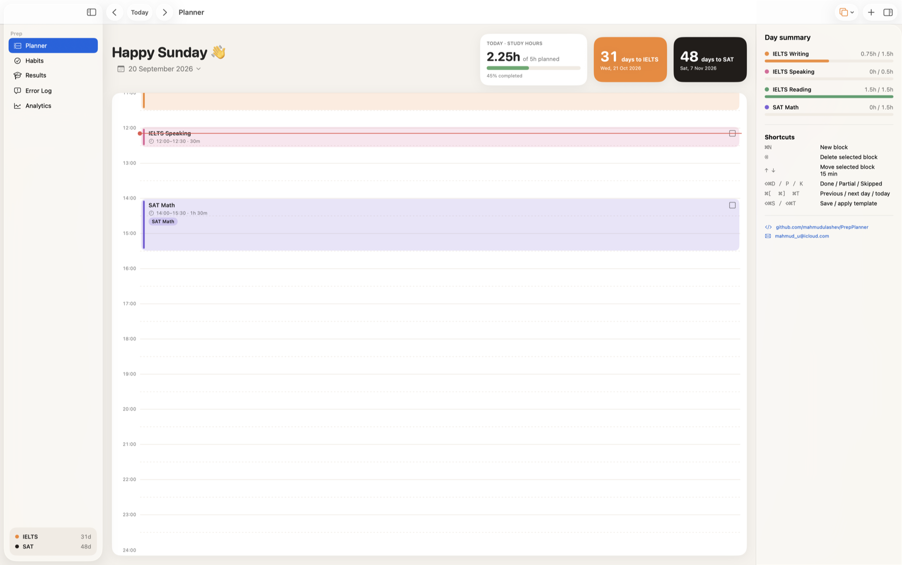
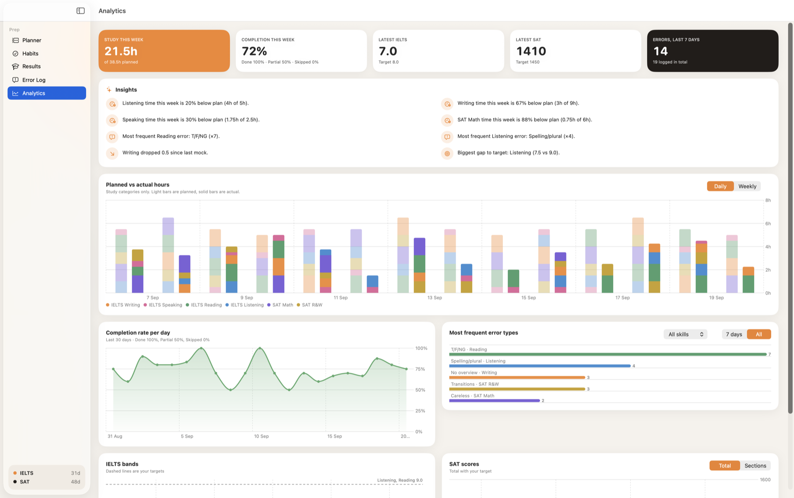
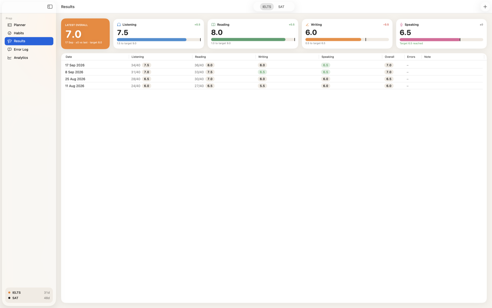
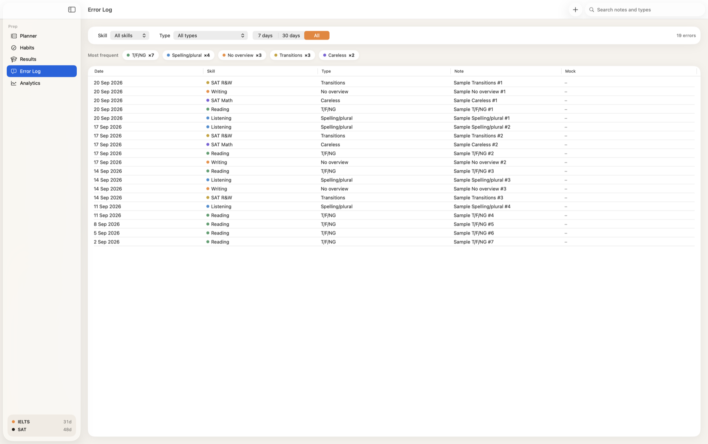
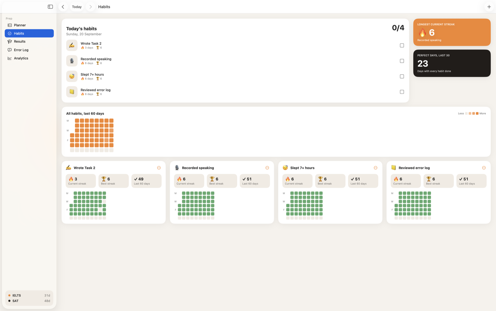

<div align="center">


# PrepPlanner

**A native macOS study planner, habit tracker and analytics dashboard for IELTS and SAT preparation.**


Plan your day in blocks, mark what you actually did, log every mistake, and watch the numbers move.
Everything stays on your Mac: no accounts, no backend, no third-party code.

</div>

---

## Screens

### Day Planner

Drag on the timeline to create a block, drag it to move, drag its edges to resize. Mark each block
Done, Partial or Skipped and record the minutes you really spent.



### Analytics

Planned vs actual hours per category, completion rate, band and score trends, the error types that
cost you most — and a short list of plain-language insights.



### Results

Raw Listening and Reading scores become bands automatically, and the overall band follows the IELTS
rounding rule. SAT sections add up to a total, with the gap to your target always visible.



### Error Log

Every mistake with its skill, type, note and the mock it came from. Filter by skill, type, date range
or text, and click a chip to drill into your most frequent error.



### Habits

A daily checklist with current and best streaks, and a GitHub-style heatmap of the last 60 days.



---

## Install

1. Download `PrepPlanner.dmg` from the [latest release](../../releases/latest).
2. Open it and drag **PrepPlanner** to Applications.
3. The app is signed with a development certificate and is not notarized by Apple, so the first
   launch is blocked with *“Apple could not verify PrepPlanner is free of malware”*. To allow it:
   - Click **Done** in that dialog — **not** *Move to Trash*, which deletes the app.
   - Open **System Settings ▸ Privacy & Security**, scroll to the **Security** section, and click
     **Open Anyway** next to the note about PrepPlanner.
   - Confirm with Touch ID or your password, then click **Open Anyway** once more.

   macOS only lists the app there after a blocked launch attempt, so step one is required. On
   macOS 15 and later the old right-click ▸ Open shortcut no longer works. The equivalent from a
   terminal is `xattr -dr com.apple.quarantine /Applications/PrepPlanner.app`.

Or build it yourself — open `PrepPlanner.xcodeproj` in Xcode and press ⌘R. A copy you build
locally is never quarantined, so it opens without any of the above.

## Tests

The scoring rules — IELTS raw-score conversion, band rounding and SAT section scores — are
covered by unit tests, since a wrong band is not visible in the UI:

```
xcodebuild test -project PrepPlanner.xcodeproj -scheme PrepPlanner -destination 'platform=macOS'
```

## Features

**Day Planner**
- Hourly timeline from 06:00 to 24:00 in 15-minute steps, one day at a time
- Create, move and resize blocks by dragging; overlapping blocks sit side by side
- Category, title, times, note, status and actual minutes per block
- Month calendar with a dot on every day that has blocks
- Day templates: save a day and apply it to a date or a whole range, with weekday filters and
  Merge / Replace / Skip handling for days that already have blocks
- Planned vs completed hours and countdowns to both exams

**Results**
- IELTS: raw Listening and Academic Reading scores (0–40) convert to bands automatically
- Overall band = average of the four bands, rounded to the nearest half band (.25 rounds up to .5,
  .75 up to the next whole band)
- Optional marking criteria (TR/CC/LR/GRA and FC/LR/GRA/P) with a suggested band
- SAT: Reading & Writing and Math (200–800) with an automatic total
- Latest score, change since the previous mock and distance to target

**Error Log**
- Date, skill, error type, note and an optional link to a mock test
- Editable error types per skill
- Filters for skill, type, last 7 / 30 days and free text

**Analytics**
- Planned vs actual hours per category, daily and weekly
- Completion rate per day (Done 100%, Partial 50%, Skipped 0%)
- IELTS band trends with dashed target lines; SAT total and section trends
- Most frequent error types, filterable
- Automatic insights, e.g. *"Writing time this week is 30% below plan"* or
  *"Listening improved +0.5 since last mock"*

**Habits**
- Daily checklist for today or any past day
- Current streak, best streak and days done in the last 60
- Heatmap per habit and one for all habits together

**Also**
- Reminder before each block starts, with snooze and a prompt to mark how it went when it ends
- Menu bar item showing the current block and time left
- Full JSON backup and restore, plus CSV export of results and the error log
- English and Uzbek (Latin), including dates and number formats

## Keyboard shortcuts

| Shortcut | Action |
|---|---|
| ⌘1 – ⌘5 | Switch section |
| ⌘N | New block at the next free slot |
| ⌫ | Delete selected block |
| ↑ / ↓ | Move selected block by 15 minutes |
| ⇧⌘D / ⇧⌘P / ⇧⌘K | Mark Done / Partial / Skipped |
| ⌘D | Duplicate block |
| ⌘T, ⌘[, ⌘] | Today, previous day, next day |
| ⇧⌘S / ⇧⌘T | Save day as template / apply template |
| ⌘E | Log an error |
| ⌘R / ⇧⌘R | New IELTS / SAT mock |
| ⌥⌘N | New habit |
| ⌥⌘I | Show or hide the inspector |
| ⇧⌘E | Export backup |
| ⌘, | Settings |

## Your data

Everything lives in a single SwiftData store at
`~/Library/Application Support/PrepPlanner/PrepPlanner.store`. Nothing is uploaded anywhere.
Use **File ▸ Export Backup** for a JSON copy; importing saves a safety copy of your current data first.

## Requirements

- macOS 14 Sonoma or later
- Xcode 16 or later to build from source

```bash
xcodebuild -project PrepPlanner.xcodeproj -scheme PrepPlanner -configuration Debug build
```

## Development notes

- **Localization** — strings live in `PrepPlanner/Localizable.xcstrings`. After adding UI text, build
  and run `python3 scripts/sync_strings.py` to add new keys and list anything still untranslated.
- **App icon** — edit `scripts/make_icon.swift` and run:
  ```bash
  swiftc -O -o /tmp/icongen scripts/make_icon.swift && /tmp/icongen PrepPlanner/Assets.xcassets/AppIcon.appiconset
  ```
- **Disk image** — `scripts/make_dmg.sh path/to/PrepPlanner.app out.dmg` builds the styled installer
  window (background, icon positions); the background itself comes from `scripts/make_dmg_background.swift`.
- **Structure** — `Models/` holds SwiftData models plus the scoring, analytics, insight and backup
  logic; `Views/` is split by screen; `Support/` has theming, formatting, reminders and the menu bar tracker.

## Contact

- GitHub: [github.com/mahmudulashev](https://github.com/mahmudulashev)
- Email: [mahmud_u@icloud.com](mailto:mahmud_u@icloud.com)

Both are also in the app under **Settings ▸ About** and in the planner's day summary panel.

## License

[MIT](LICENSE)
